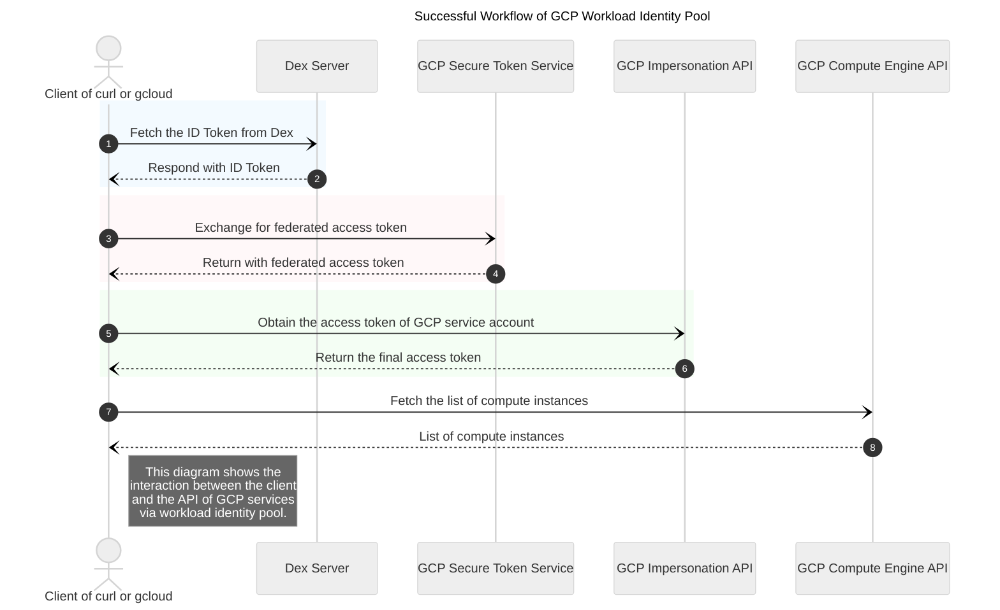

This guide describes how to use Workload Identity Federation with [Dex](https://github.com/dexidp/dex).

  To authenticate to Google Cloud, you can let the workload exchange its environment-specific credentials for short-lived Google Cloud credentials by using Workload Identity Federation.

So you don't need to maintain the GCP service account key in your local environment forever. 

The below figure describe the successful workflow:




## 1. Dex

Dex is an open source identity service that can be authenticated with other apps. If you don't have an OIDC provider already, you are able to create one by Dex very easily.

There are many ways to startup a Dex server, but installing it into kubernetes cluster is probably the simplest way, eg, [k8s manifest](https://github.com/dexidp/dex/tree/master/examples/k8s).

### 1.1 Prepare a LDAP server

Dex need a User database as its backend, you can refer to [this page](https://blog.amyinfo.com/2024-05-30-openldap-on-openwrt/) to install your own LDAP server. 

### 1.2 Start up Dex server

Just make some changes to the configuration of Dex, to use openldap as a connector.

Assume that you have the Domain `dex.example.com` for the Dex server, this domain don't need to be public accessible if you upload your `jwks.json` file to workload identity provider.

```yaml
kind: ConfigMap
apiVersion: v1
metadata:
  name: dex
  namespace: dex
data:
  config.yaml: |
    issuer: https://dex.example.com
    storage:
      type: kubernetes
      config:
        inCluster: true
    web:
      http: 0.0.0.0:8080
    connectors:
    - type: ldap
      id: ldap
      name: LDAP
      config:
        host: 192.168.1.1:389
        insecureNoSSL: true
        bindDN: cn=admin,dc=example,dc=com
        bindPW: <DN password>
        usernamePrompt: SSO Username
        userSearch:
          baseDN: ou=devops,dc=example,dc=com
          filter: "(objectClass=posixAccount)"
          username: uid
          idAttr: DN
          emailAttr: mail
          nameAttr: sn
        groupSearch:
          baseDN: ou=groups,dc=example,dc=com
          filter: "(objectClass=posixGroup)"
          userMatchers:
          - userAttr: uid
            groupAttr: memberUid
          nameAttr: cn
    oauth2:
      skipApprovalScreen: true
      passwordConnector: ldap

    staticClients:
    - id: example-app
      redirectURIs:
      - 'https://gcp.googleapis.com/projects/226123987652/locations/global/workloadIdentityPools/test'
      name: 'Example App'
      secret: ZXhhbXBsZS1hcHAtc2VjcmV0

    enablePasswordDB: true
    staticPasswords:
    - email: "admin@example.com"
      hash: "$2a$10$2b2cU8CPhOTaGrs1HRQuAueS7JTT5ZHsHSzYiFPm1leZck7Mc8T4W"
      username: "admin"
      userID: "08a8684b-db88-4b73-90a9-3cd1661f5466"
```

Test Dex is ready:

```bash
curl -s https://dex.example.com/.well-known/openid-configuration
```

## 2. Setup workload identity federation on GCP

### 2.1 Create workload identity

Retrieve jwks file from Dex:

```bash
curl -L -o jwks.json https://dex.example.com/keys
```

Create workload identity with gcloud

```bash
gcloud iam workload-identity-pools create test --location="global" \
    --description="Access gcp with Dex" --display-name=test

gcloud iam workload-identity-pools providers create-oidc dex --location="global" \
    --workload-identity-pool=test --issuer-uri="https://dex.example.com" \
    --attribute-mapping="google.subject=assertion.sub,google.groups=assertion.groups" \
    --jwk-json-path="cluster-jwks.json"
```

### 2.2 Grant permissions on compute instances

First create a GCP service account and grant `roles/compute.viewer` to the SA, then you are able to use workload identity pool to impersonate this SA to get access to GCP service, eg compute instances here.

```bash
gcloud iam service-accounts create compute-viewer

gcloud projects add-iam-policy-binding projects/<your project name> --role=roles/compute.viewer \
    --member="compute-viewer@<your project name>.iam.gserviceaccount.com" --condition=None

gcloud iam service-accounts add-iam-policy-binding \
  compute-viewer@<your project name>.iam.gserviceaccount.com \
    --member="principalSet://iam.googleapis.com/projects/<Project Number>/locations/global/workloadIdentityPools/test/group/qa" \
    --role=roles/iam.workloadIdentityUser
```


### 2.3 Get credential configuration of workload identity

To create a credential configuration file with `gcloud`

```bash
gcloud iam workload-identity-pools create-cred-config \
  projects/<Project Number>/locations/global/workloadIdentityPools/test/providers/dex \
  --credential-source-file=/path/to/id/token \
  --credential-source-type=text \
  --service-account=compute-viewer@<your project name>.iam.gserviceaccount.com \
  --output-file=credential-configuration.json
```

The credential configuration file lets the client, eg `curl`, to determine the following:

- Where to obtain external credentials from
- Which workload identity pool and provider to use
- Which GCP service account to impersonate

## 3. Access GCP service with Dex ID token

The workload identity pool is ready now, you just need to use the ID token from Dex to authenticate with GCP

### 3.1 Obtain ID token from Dex

Use your ldap user to get a ID token from the Dex API, and store the token to `/path/to/id/token`

```bash
DEX_HOST="https://dex.example.com"
OIDC_CONFIG=$(curl -s $DEX_HOST/.well-known/openid-configuration)
TOKEN_ENDPOINT=$(echo $OIDC_CONFIG | jq -r .token_endpoint)

# those are in configmap of Dex
CLIENT_ID="example-app"
CLIENT_SECRET="ZXhhbXBsZS1hcHAtc2VjcmV0"
USERNAME="alice" # LDAP user

read -s -p "Enter LDAP Password: " PASSWORD

echo

# Fetch ID Token
ACCESS_TOKEN=$(curl -s -X POST $TOKEN_ENDPOINT \
  -H "Content-Type: application/x-www-form-urlencoded" \
  -d "grant_type=password" \
  -d "client_id=$CLIENT_ID" \
  -d "client_secret=$CLIENT_SECRET" \
  -d "username=$USERNAME" \
  -d "password=$PASSWORD" \
  -d "scope=openid email groups" \
    | jq -r .access_token)

echo $ACCESS_TOKEN > /path/to/id/token

USERINFO_ENDPOINT=$(echo $OIDC_CONFIG | jq -r .userinfo_endpoint)
# For test
curl -s -H "Authorization: Bearer $ACCESS_TOKEN" $USERINFO_ENDPOINT
```

### 3.2 List compute instances

Use the above ID token to exchange access token of GCP, then use it to list compute instances in your project.

```bash
#!/bin/bash

DEX_TOKEN_PATH=/path/to/id/token
WORKLOAD_IDENTITY_CREDENTIALS=credential-configuration.json
project_id=<your project name>
zone=us-central1-a

# Exchanges OIDC jwt token with GCP security Token Service to get federated access token
TOKEN_EXCHANGE_RESPONSE=$(curl -X POST https://sts.googleapis.com/v1/token \
-H 'Content-Type: application/json; charset=utf-8' \
--data-binary @- << EOF
{
  "audience": "$(cat $WORKLOAD_IDENTITY_CREDENTIALS | jq -r '.audience')",
  "grantType": "urn:ietf:params:oauth:grant-type:token-exchange",
  "scope": "openid https://www.googleapis.com/auth/cloud-platform https://www.googleapis.com/auth/userinfo.email", 
  "subjectToken": "$(cat $DEX_TOKEN_PATH)",
  "requestedTokenType": "urn:ietf:params:oauth:token-type:access_token",
  "subjectTokenType": "urn:ietf:params:oauth:token-type:jwt"

}
EOF
)

echo "$TOKEN_EXCHANGE_RESPONSE" | jq

# Obtain a service account token via the service account impersonation API
IMPERSONATION_URL="$(cat $WORKLOAD_IDENTITY_CREDENTIALS | jq -r '.service_account_impersonation_url')"

ACCESS_TOKEN_RESPONSE=$(curl -X POST "$IMPERSONATION_URL" -H "Authorization: Bearer $(echo "$TOKEN_EXCHANGE_RESPONSE" | jq -r '.access_token')" \
-H "Content-Type: application/json" --data '{"scope": ["https://www.googleapis.com/auth/cloud-platform", "openid", "https://www.googleapis.com/auth/userinfo.email"]}')

echo $ACCESS_TOKEN_RESPONSE | jq

# Use the access token to call the Google API
curl -H "Authorization: Bearer $(echo "$ACCESS_TOKEN_RESPONSE" | jq -r '.accessToken')" https://www.googleapis.com/oauth2/v3/tokeninfo
curl "https://oauth2.googleapis.com/tokeninfo?access_token=$(echo $ACCESS_TOKEN_RESPONSE | jq -r '.accessToken')"

# Use the access token to list compute instances
curl -H "Authorization: Bearer $(echo "$ACCESS_TOKEN_RESPONSE" | jq -r '.accessToken')" "https://compute.googleapis.com/compute/v1/projects/$project_id/zones/$zone/instances"
```


Ok, That's all.

## 4. References

1. [dex - A federated OpenID Connect provider](https://github.com/dexidp/dex)
2. [Configure Workload Identity Federation with Kubernetes](https://cloud.google.com/iam/docs/workload-identity-federation-with-kubernetes)
3. [Dex Authentication Through LDAP](https://dexidp.io/docs/connectors/ldap/)