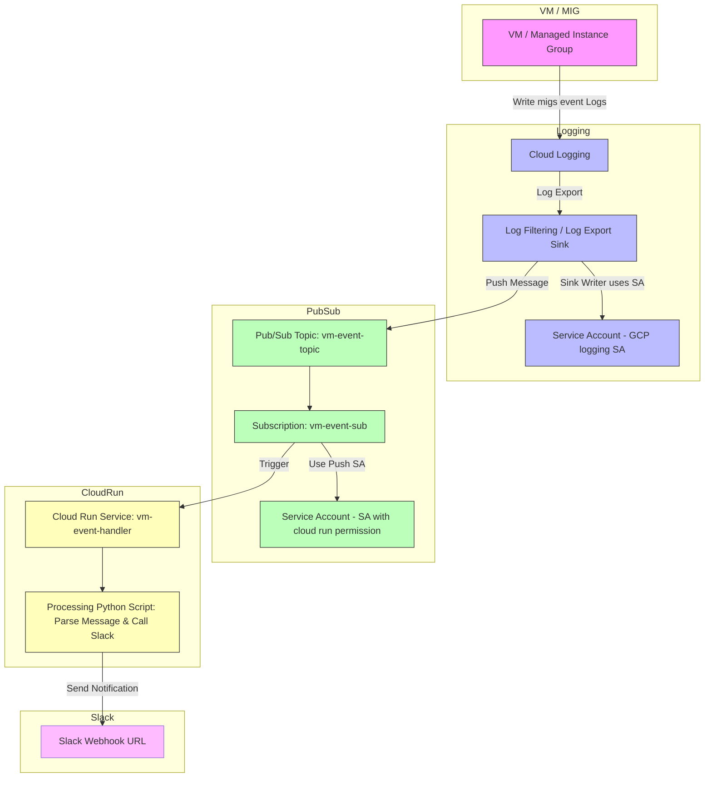

Monitoring your infrastructure and receiving timely alerts is crucial for smooth operations. In this post, I’ll walk you through how to build a fully serverless alerting pipeline on Google Cloud Platform (GCP) that collects VM or Managed Instance Group (MIG) events, pushes them through Pub/Sub, processes them with Cloud Run, and sends notifications to Slack. All using mostly free-tier GCP services.

## Overview

The workflow consists of:

- **VM/MIG generating events** – Operations and scaling events on migs.
- **Cloud Logging** – Collects logs and exports them through a Sink to Pub/Sub.
- **Pub/Sub** – Acts as a reliable messaging bus.
- **Cloud Run** – Processes the events, runs custom logic (e.g., Python script), and forwards notifications.
- **Slack Webhook**  – Receives alerts for real-time notifications.



## Step 1: Configure Logging Export

1. Create Pub/Sub topic

```bash
gcloud pubsub topics create mig-event-topic
```

2. Create a Log Sink in Cloud Logging:

```bash
gcloud logging sinks create mig-event-sink \
    pubsub.googleapis.com/projects/${GCP_PROJECT_ID}/topics/mig-event-topic \
    --log-filter='resource.type="gce_instance_group_manager" AND resource.labels.instance_group_manager_name="nat-gateway-mig"'
```

Ensure GCP logging Service Account(eg, service-xxxxxxx@gcp-sa-logging.iam.gserviceaccount.com) has the Pub/Sub Publisher permissions.

## Step 2: Deploy Cloud Run Service

In your working directory, you need to create the below 3 files:

1. **main.py**:

```python
import os
import json
import base64
import requests
from flask import Flask, request

app = Flask(__name__)

SLACK_WEBHOOK = os.environ.get("SLACK_WEBHOOK_URL")

@app.route("/", methods=["POST"])
def notify():
    envelope = request.get_json()
    if not envelope:
        return "No Pub/Sub message received", 400

    message = envelope.get("message", {})
    data = message.get("data")
    if data:
        decoded = base64.b64decode(data).decode("utf-8")
        try:
            payload = json.loads(decoded)
        except json.JSONDecodeError:
            payload = decoded

        # Extract the mig name from pubsub message
        mig_name = payload.get("resource", {}).get("labels", {}).get("instance_group_manager", "")

        event_type = payload.get("protoPayload", {}).get("methodName", "Unknown Event")
        text = f"MIG Event: {mig_name} | Type: {event_type}"

        requests.post(SLACK_WEBHOOK, json={"text": text})

    return "OK", 200
```

2. **Dockerfile**:

```Dockerfile
FROM python:3.11-slim
WORKDIR /app
COPY requirements.txt .
RUN pip install -r requirements.txt
COPY main.py .
CMD ["gunicorn", "-b", ":8080", "main:app"]
```

3. **requirements.txt**:

```txt
flask
requests
gunicorn
```

4. Create the cloud run service

```bash
gcloud run deploy mig-event-handler \
  --source . \
  --region us-central1 \
  --platform managed \
  --set-env-vars SLACK_WEBHOOK_URL="https://hooks.slack.com/services/xxxxxx/xxxxxxx"
```

## Step 3: Use subscription to push message to Cloud Run

1. First, create a SA to trigger Clour Run

```bash

gcloud iam service-accounts create pubsub-to-cloudrun \
  --display-name="Pub/Sub to Cloud Run SA"

gcloud run services add-iam-policy-binding mig-event-handler \
  --member="serviceAccount:pubsub-to-cloudrun@${GCP_PROJECT_ID}.iam.gserviceaccount.com" \
  --role="roles/run.invoker" \
  --region=us-central1
```

2. Create a subscription to push message

```bash
gcloud pubsub subscriptions create mig-event-sub \
  --topic=mig-event-topic \
  --push-endpoint=https://mig-event-handler-xxxxxxxx.us-central1.run.app/ \
  --push-auth-service-account=pubsub-to-cloudrun@${GCP_PROJECT_ID}.iam.gserviceaccount.com
```

## Conclusion

This architecture allows you to implement a fully serverless, scalable, and low-cost alerting pipeline using GCP’s Logging, Pub/Sub, and Cloud Run, with real-time notifications via Slack. It’s modular and can be extended for multiple log types, more complex processing, or additional notification channels.
