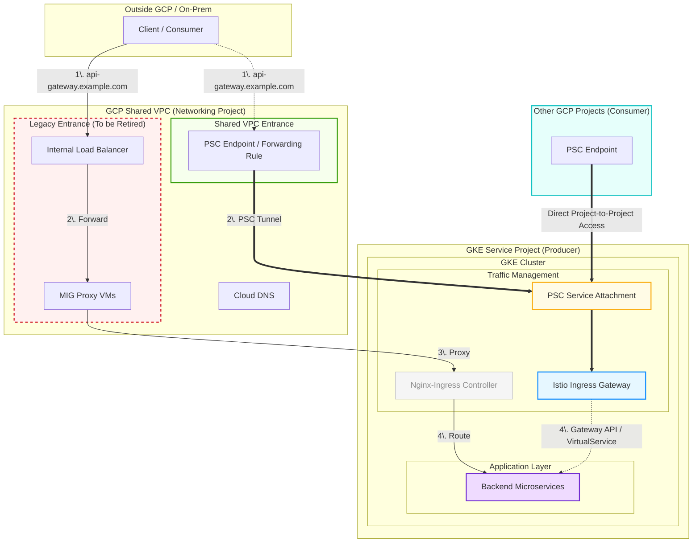

---

## 1. Executive Summary

nginx-ingress is retiring (security patches stopped March 2026). We must migrate to a new ingress solution. The final choice is not yet decided — options under consideration include self-hosted Istio, GCP Cloud Service Mesh, Envoy Gateway, and other ingress controllers.

**Proposed approach:** Use Istio as an **interim placeholder** to unblock application teams and establish the new traffic ingress path, while keeping the final decision open. This allows parallel preparation without committing to a specific long-term solution prematurely.

---

## 2. Context & Motivation

| Item | Detail |
|---|---|
| **Trigger** | nginx-ingress retirement — no security patches after March 31, 2026 |
| **Current State** | nginx-ingress (likely with `Ingress` resources) handling all external traffic |
| **Final Options** | Self-hosted Istio, GCP Cloud Service Mesh (CSM), Envoy Gateway, other ingress controllers |
| **Gap** | Final decision not yet made; migration cannot wait |
| **Interim Solution** | Deploy Istio as placeholder — coexists with nginx-ingress, no disruption to current services |

---

## 3. Migration Strategy Overview

```
Phase 1: Install new gateway (Istio) alongside nginx-ingress
Phase 2: Enable GCP Private Service Connect for new gateway
Phase 3: Application teams create Gateway resources → regression/functional/performance tests
Phase 4: (Optional) CoreDNS + ExternalDNS for test DNS automation
Phase 5: DNS cutover to new IP
Phase 6: Observe, then demis nginx-ingress
```
**Network traffic**



**Key principle:** Both gateways coexist. nginx-ingress continues serving production traffic. Istio is validated in parallel with zero impact.

---

## 4. Detailed Migration Steps

### Step 1 — Install the New Gateway (Istio) into Clusters

**Goal:** Deploy Istio ingress gateway as an interim solution alongside the existing nginx-ingress.

**Co-existence mechanism:**
- nginx-ingress watches `Ingress` resources (or `IngressClass` assigned to it)
- Istio ingress gateway watches `Gateway` and `VirtualService` resources
- **No conflict** — they watch different Kubernetes resource types

**Considerations:**
- Keep nginx-ingress running unchanged — do NOT modify existing `Ingress` resources
- Allocate a separate IP / LoadBalancer for Istio gateway (avoid port conflicts)

---

### Step 2 — Enable GCP Private Service Connect for the New Gateway

**Goal:** Use GCP Private Service Connect (PSC) as the network entrance for the new gateway, providing private, secure access without exposing traffic to the public internet, no depends on the VM proxies.

**Producer side:**
- Create an internal passthrough Network Load Balancer for the Istio gateway (Service with internal LB annotation)
- Create a ServiceAttachment to publish the service via PSC

**Consumer side (access from other projects and non-gcp):**
- Create a PSC endpoint forwarding rule in the shared VPC pointing to the ServiceAttachment(for non-gcp)
- (Optional) create psc endpoint inside the consumer's gcp project, so no need to access via GKEOUT proxy

---

### Step 3 — Application Team Onboarding & Testing

**Goal:** Need Application teams' help to create `Gateway` and `VirtualService` resources for our services. Run full regression, functional, and performance tests on both HTTP and TCP ports using the new entrance — with **zero impact** to current services.

**Workflow for each application:**

1. **Application team creates Gateway resources:** Application teams create `Gateway` and `VirtualService` resources following Istio's networking API, using the same hostnames of  the previous Ingress objects and routing rules to the backend services.

2. **Set up custom hosts for pods** (test traffic routing):
   - Point DNS name to the Istio gateway IP (via internal DNS or `hostAliases` for pod-level testing) on the pods we run the regression tests.
   - Run tests against the new gateway without affecting production DNS

3. **Test scope:**
   - ✅ HTTP/HTTPS regression tests
   - ✅ TCP port connectivity tests (for denodo JDBC ports)
   - ✅ Functional tests (end-to-end)
   - ✅ Performance/load tests (compare latency, throughput vs. nginx-ingress baseline)
   - ✅ mTLS verification (if enabled in Istio)

4. **No production impact:** Production traffic continues through nginx-ingress. Test traffic uses separate hostnames pointing to the Istio gateway IP.

---

### Step 4 — (Optional) CoreDNS + ExternalDNS for Test DNS Automation

**Goal:** If feasible, set up a dedicated CoreDNS instance for pods running tests[[1](https://kubernetes.io/docs/concepts/services-networking/dns-pod-service/#pod-dns-config)], and use ExternalDNS to manage those DNS records. This avoids manual `hostAliases` or CloudDNS setup for test records, and paves the way for automated DNS management in the final migration.

**Why this helps:**
- When the final migration happens, CloudDNS records are already managed by ExternalDNS
- No manual CloudDNS setup needed at cutover time — just switch the ExternalDNS provider if needed

**Architecture:**
```
Application Pods (test)
     ↓
CoreDNS (custom, for test zone)
     ↓
ExternalDNS (watches Istio Gateway resources)
     ↓
Google CloudDNS (test zone)
```

**Note:** This step is **optional** for the initial migration path, and the self-managed coreDNS instance only works inside the gke cluster. It provides DNS automation benefits but is not a blocking requirement.

---

### Step 5 — DNS Cutover

**Goal:** Switch production DNS to point to the new gateway IP after all tests pass.

**Pre-cutover checklist:**
- [ ] All application teams have validated their services through the Istio gateway
- [ ] Regression, functional, and performance tests pass
- [ ] No degradation in latency or error rates vs. nginx-ingress baseline
- [ ] Rollback plan validated (Step 6 below)

**Cutover steps:**
1. **Update DNS records** to point to Istio gateway IP via gcloud DNS commands or Cloud Console
2. **Or if using ExternalDNS** with CloudDNS provider — Need to remove the previous DNS records first, then update the `Gateway` resource hosts to include production hostnames and let ExternalDNS sync automatically

**Traffic splitting option (gradual cutover):**
- Might need to lower the DNS TTL for quick propagation

---

### Step 6 — Observe & Demise Old Solution

**Goal:** Monitor the new system in production for several days, then plan retirement of nginx-ingress.

**Observation period (recommended: 7–14 days):**
- Monitor error rates, latency (p50, p95, p99), throughput
- Compare against pre-migration nginx-ingress baseline
- Check Istio Proxy (Envoy) and control plane health
- Validate mTLS and security policies (if applicable)

**Metrics to watch:**
- Integrate Istio's built-in observability addons (Prometheus, Grafana, Kiali) with our current observability tools to monitor metrics

**Demise plan (after observation period):**
1. Confirm no traffic is flowing through nginx-ingress (check LB metrics)
2. Scale down the GKEIN proxy
3. Disable the nginx-ingress in the tooling module.
4. Remove the Ingress objects
5. Release any VMs and ilb.
6. Update documentation

---

## 5. Istio as Interim vs. Final Solution Options

The following table compares the solutions under consideration for the **final** decision. Istio is being used as the interim placeholder regardless.

| Dimension | Self-Hosted Istio | GCP Cloud Service Mesh (CSM) | Envoy Gateway | Other Ingress Controllers |
|---|---|---|---|---|
| **Type** | Full service mesh | Managed service mesh (Envoy-based) | API Gateway (north-south only) | Varies |
| **Control Plane** | In-cluster (istiod) or none (Ambient) | Google-managed (Traffic Director) | In-cluster (Envoy Gateway controller) | Varies |
| **Data Plane** | Envoy (sidecar or Ambient ztunnel) | Envoy (sidecar or proxyless gRPC) | Envoy (gateway pods only) | Varies |
| **East-West (service-to-service)** | ✅ Full mesh | ✅ Full mesh (multi-cluster support) | ❌ North-south only | ❌/⚠️ Limited |
| **mTLS** | ✅ Automatic | ✅ Managed, automatic | ✅ Gateway-to-backend | Varies |
| **Advanced Traffic Management** | ✅ Full (splitting, mirroring, fault injection) | ✅ Full (global load balancing) | ✅ HTTPRoute, GRPCRoute | Limited |
| **Observability** | ✅ Kiali, Prometheus, Jaeger | ✅ Cloud Monitoring, Trace (built-in) | ✅ Via Envoy telemetry | Limited |
| **Operational Overhead** | High (self-managed control plane) | Low (Google-managed) | Medium | Low-Medium |
| **Multi-Cluster** | ✅ (Ambient multicluster, beta) | ✅ (fleet-wide, global control plane) | ❌ Single cluster | Varies |
| **Gateway API Support** | ✅ Full | ✅ Full (Kubernetes Gateway API) | ✅ Reference implementation | Partial |
| **Resource Overhead** | Medium-High (sidecar per pod) | Medium (managed control plane saves ops) | Low (no sidecars) | Low |
| **Suitable If...** | Need full mesh + custom Envoy filters | GCP-native, multi-cluster, low ops | API gateway only, no mesh needed | Simple ingress needs |

---

## 6. Risk Assessment & Rollback Plan

| Risk | Mitigation |
|---|---|
| Istio gateway misconfiguration | Keep nginx-ingress running; test with separate hostnames first |
| Performance degradation | Load test before cutover; compare against nginx-ingress baseline |
| mTLS policy blocks traffic | Start with `PERMISSIVE` mode; tighten gradually |
| DNS cutover issues | Short TTL (60s) before cutover; keep old LB running as fallback |
| Application team delay | Parallel onboarding; critical services first |
| ExternalDNS misconfiguration | Validate in test zone before touching production DNS |

**Rollback plan (if issues after cutover):**
1. Revert DNS to nginx-ingress IP (with short TTL, propagates quickly) via gcloud DNS commands
2. nginx-ingress is still running and serving traffic — zero downtime rollback

---

## 7. Open Questions for Discussion

1. **Final solution decision timeline:** When does the team expect to decide between Istio / CSM / Envoy Gateway / other?
2. **mTLS requirement:** Do we need mutual TLS for service-to-service communication, or is north-south TLS termination sufficient?
3. **Cost consideration:** GCP Cloud Service Mesh has no separate charge for the managed control plane, but Envoy Gateway even has zero sidecar overhead 
4. **Step 4 (CoreDNS + ExternalDNS):** Should we invest in this automation now, or keep it simple with manual DNS for the interim period?
5. **Sidecar vs. Ambient mode:** If we stay with Istio long-term, should we evaluate Ambient mode (sidecar-free) to reduce resource overhead?

---

## 8. References

- [Pod's DNS Config](https://kubernetes.io/docs/concepts/services-networking/dns-pod-service/#pod-dns-config)
- [Istio / Ingress Side-by-Side Migration Guide](https://istio.io/latest/docs/tasks/traffic-management/ingress/ingress-control/)
- [GKE Private Service Connect Documentation](https://cloud.google.com/kubernetes-engine/docs/concepts/private-service-connect)
- [ExternalDNS Istio Gateway Source](https://kubernetes-sigs.github.io/external-dns/latest/docs/sources/istio/)
- [Cloud Service Mesh Gateway API Overview](https://cloud.google.com/service-mesh/docs/gateway/overview)
- [Envoy Gateway vs Istio Comparison](https://kb.ekarisky.com/service-mesh/comparisons/service-mesh-comparison/)
- [Migrating from Ingress NGINX to Gateway API with Istio](https://blogs.vmware.com/cloud-foundation/2026/03/28/ingress-nginx-to-gateway-api-istio-vks-migration/)

---

*This document is a living draft. Updated as the migration progresses and decisions are made.*
